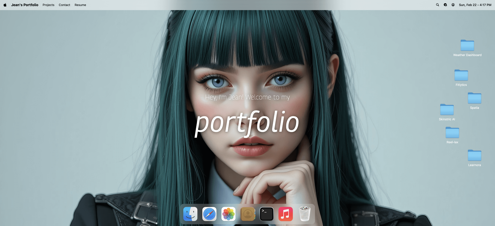

# macOS-Style Portfolio

A modern, interactive portfolio website built with React that mimics the macOS desktop experience. Features a draggable dock, window management system, and various applications including a music player, photo gallery, and more.

## ✨ Features

- **macOS-Inspired UI** - Authentic macOS window controls, dock, and animations
- **Window Management** - Draggable, minimizable, and maximizable windows
- **Interactive Applications**:
  - 🎵 Music Player with playlist support
  - 📸 Photo Gallery with masonry layout
  - 📄 Resume Viewer
  - 💼 Projects Showcase
  - ✉️ Contact Information
  - 🌐 Blog/Safari Browser
  - 💻 Terminal with Tech Stack
  - 📁 Finder File Explorer
- **Animations** - GSAP-powered transitions and interactions
- **Responsive Design** - Optimized for desktop viewing (will work on mobile view in the future.)

## 🛠️ Tech Stack

- **Frontend Framework**: React 
- **Build Tool**: Vite 
- **Styling**: Tailwind CSS 
- **Animations**: GSAP with Draggable plugin
- **State Management**: Zustand
- **Icons**: Lucide React
- **Fonts**: Google Fonts (Georama, Roboto Mono)

## 👤 Author

**Jean Richardson**
- GitHub: [Jean Richardson](https://github.com/jeanrichardson610)
- LinkedIn: [Jean Richardson](https://linkedin.com/in/jean-marsalais-richardson)
- Portfolio: [JR Studio](https://www.jr-studio.space/)

## 🙏 Acknowledgments

- Icons by [Lucide](https://lucide.dev)
- Fonts from [Google Fonts](https://fonts.google.com)

---

