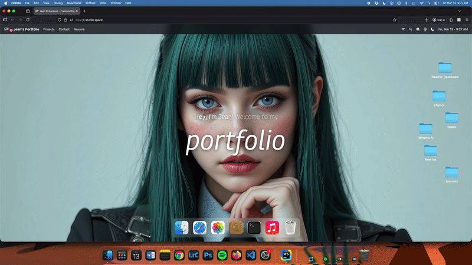

# 🖥️ JR Studio Space | Mac OS-Inspired Portfolio

A modern, interactive portfolio website built with **React**, inspired by the macOS desktop experience. Features a draggable dock, window management system, and multiple applications including a music player, photo gallery, resume viewer, terminal, and more.

<p align="center">
  
</p>

<p align="center">
  
  
  
  
  
  
</p>

<p align="center">
  
</p>


---

## ✨ Core Features

- **macOS-Inspired UI** — Authentic window controls, draggable dock, and animations  
- **Window Management** — Draggable, minimizable, maximizable windows with responsive positioning  
- **Interactive Applications**:  
  - 🎵 Music Player with playlist support  
  - 📸 Photo Gallery with dynamic masonry layout  
  - 📄 Resume Viewer  
  - 💼 Projects Showcase  
  - 🌑 Dark & Light Mode  
  - ✉️ Contact Information  
  - 🌐 Blog / Safari Browser  
  - 💻 Terminal showing tech stack  
  - 📁 Finder File Explorer  
- **GSAP Animations** — Smooth transitions, hover effects, draggable outlines, and snap-back logic  
- **Responsive Design** — Optimized for desktop; mobile/tablet ready with touch-friendly interactions  
- **Advanced Touch & Pointer Support** — Buttons, drag, and interactive elements respond reliably on Android and iOS  

---

## 🛠️ Tech Stack

| Layer | Technology |
|-------|------------|
| Frontend | React 19, TypeScript |
| Styling | Tailwind CSS v4 |
| Animations | GSAP (with Draggable plugin) |
| State Management | Zustand v5 |
| Icons | Lucide React |
| Fonts | Google Fonts (Georama, Roboto Mono) |
| Build Tool | Vite 7 |

---

## 🚀 Project Enhancements & Solutions

### 1️⃣ Responsive Architecture

**Problem:** Original layout was desktop-first, breaking navigation, icons, and windows on smaller screens.  

**Solution:**  
- Navigation links hidden under 640px, only essential icons displayed.  
- Desktop icons hidden under 1024px to avoid overlap.  
- Image gallery scrollable under 768px with dynamic column adjustment.  
- Conditional visibility moved from CSS to JSX for better control.  

**Lesson Learned:** Hide specific elements instead of entire containers to maintain layout integrity.  

---

### 2️⃣ Window Positioning System

**Problem:** Windows were absolutely positioned, opening off-center or overflowing on smaller screens.  

**Solution:**  
- Under 1200px: windows auto-center using fixed positioning with CSS transform.  
- Under 768px: windows adopt static positioning, full-width, mobile-friendly.  
- Fully reset conflicting CSS properties (position, top, left, transform, margin) across breakpoints.  

**Lesson Learned:** Always reset all related properties when adapting layouts across breakpoints.  

---

### 3️⃣ Dark & Light Mode System

**Features:**  
- Theme toggle with animated Sun/Moon icon swap.  
- Background wallpaper transitions using GSAP overlay animation.  
- Dark styling applied consistently to Finder, Safari, Terminal, Contact, Resume, and Image Preview.  

**Lesson Learned:** CSS variables + GSAP overlays allow smooth, flicker-free theme transitions.  

---

### 4️⃣ Touch Reliability Fixes

**Problem:** Buttons worked on iOS but failed on Android due to `onClick` and draggable containers.  

**Solution:**  
- Replaced `onClick` with `onPointerDown` and `onTouchStart` for unified mouse + touch behavior.  
- Applied to window close buttons, “Set as Wallpaper” button, and other interactive elements.  

**Lesson Learned:** `onPointerDown` ensures cross-device interaction consistency.  

---

### 5️⃣ GSAP Draggable Enhancements

- Placeholder outlines during drag  
- Snap-back thresholds for better control  
- Z-index management  
- Cursor state changes (grab → grabbing)  
- Disabled text selection during drag  

---

### 6️⃣ UI & Micro-Interaction Polish

- Smooth hover transitions and icon animations  
- Backdrop blur tuning and consistent border radii  
- Mobile layout padding adjustments and overflow control  

---

### 7️⃣ Architecture Refinement

- Reduced reliance on CSS-only media hiding  
- Scoped dark-mode selectors more carefully  
- Improved class naming consistency  
- Conditional visibility handled in JSX rather than hiding parent containers  

**Technical Growth Achieved:**  
Responsive architecture, breakpoint layering, cross-device event handling, advanced CSS overrides, GSAP animation coordination, UI system thinking.  

---

## 👨‍💻 Installation

**Requirements:** Node.js 20+

```bash
# Clone the repository
git clone https://github.com/<your-username>/jr-studio-space.git
cd jr-studio-space

# Install dependencies
npm install

# Start development server
npm run dev

# Build for production
npm run build

# Preview production build
npm run preview